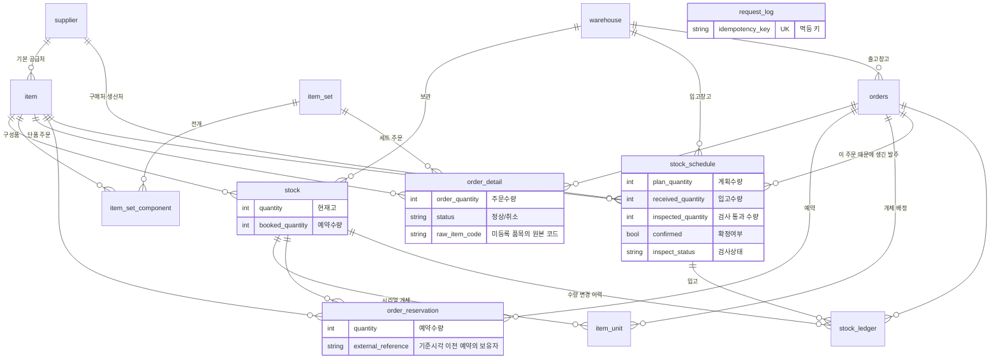

# 지큐브 스페이스 채용과제 — 주문·재고·발주 통합 웹

물류 담당자가 배송일별로 무엇을 준비할 수 있고 무엇이 막혀 있는지 판단하고, 막힌 주문은
발주로 풀어내는 업무 도구입니다. 제품·주문·발주 세 화면이 같은 데이터를 다른 관점에서
보여 주고, 한쪽에서 처리한 결과가 다른 쪽에 바로 반영됩니다.

업무 기준시각은 **2026년 7월 21일 오전 9시**입니다. 실제 시계를 쓰면 데이터의 배송예정일이
전부 과거가 되어 "배송일 전날까지 쓸 수 있는 입고예정" 같은 규칙이 의미를 잃으므로,
`app.base-time` 으로 고정 `Clock` 을 주입하고 업무 판단에 쓰는 '오늘'은 모두 여기서 가져옵니다.

### 먼저 볼 것

과제에서 가장 어려운 판단 세 가지가 어디에 있는지 적어 둡니다.

| 판단 | 어디에 | 무엇이 걸려 있나 |
| --- | --- | --- |
| **전역 배분** — 앞 주문이 가져간 재고를 뒤 주문이 다시 쓰지 못하게 | `ReadinessPlanner` | 주문을 하나씩 따로 보면 같은 재고를 여러 주문이 중복으로 세어 **전부 "준비 가능"으로 보입니다** |
| **락만으로는 부족한 자리** — 판정 때 읽어 둔 숫자도 믿지 않기 | `OrderCommandService.reserve` | `SELECT … FOR UPDATE` 를 날려도 영속성 컨텍스트가 옛날 값을 돌려줘 **락은 잡히고 숫자는 낡습니다** |
| **멱등성의 두 성격** — 상태로 막을 것과 키로 막을 것 | `IdempotencyGuard`, `front/src/lib/api.ts` | 발주·입고는 "같은 수량을 또 넣는 것"이 정상일 수 있어 **상태만으로는 중복을 가릴 수 없습니다** |

`./gradlew test` 73개가 요구사항 5의 시나리오 8개를 `@DisplayName` 에 번호째로 달고 돕니다.

---

## 실행 및 데이터 적재 방법

Java 17, Node 20, Docker 가 필요합니다. 저장소 루트에서 터미널 3개를 띄웁니다.

```bash
# 1) MySQL 8.4 — 스키마와 과제 데이터가 이때 한 번 적재됩니다
docker compose up -d

# 2) 백엔드 API — http://localhost:8080
cd back && ./gradlew bootRun

# 3) 화면 — http://localhost:3000
cd front && npm install && npm run dev
```

**화면 주소는 http://localhost:3000 입니다.**

| 화면 | 주소 |
| --- | --- |
| 제품 | <http://localhost:3000/items> |
| 주문 | <http://localhost:3000/orders> |
| 발주 | <http://localhost:3000/schedules> |

브라우저는 같은 오리진의 `/api` 로만 호출하고, `front/next.config.ts` 의 rewrite 가
`http://localhost:8080` 으로 넘깁니다. CORS 설정을 서버에 두지 않기 위한 구조입니다.
백엔드 주소를 바꾸려면 `front/.env` 에 `API_ORIGIN` 을 지정하세요 (`front/.env.example` 참고).

`docker compose` 는 `./back/src/...` 를 상대경로로 마운트하므로 **반드시 저장소 루트에서**
실행해야 합니다. `docker-compose.yml` 이 아래 두 파일을 컨테이너의
`/docker-entrypoint-initdb.d` 로 마운트합니다.


| 파일 | 내용 |
| --- | --- |
| `back/src/main/resources/schema/schema.sql` | 13개 테이블 DDL |
| `back/src/main/resources/schema/sample.sql` | 과제 제공 엑셀을 옮긴 기준 데이터 (10개 테이블) |

initdb 스크립트는 **데이터 디렉터리가 비어 있을 때만** 실행됩니다. 즉 앱이 처리한 예약·출고·입고
결과는 컨테이너를 다시 띄워도 남습니다. 기동할 때마다 적재하면 `sample.sql` 의 `DELETE` 가 그동안의
처리 결과를 지우기 때문에, 앱 쪽은 `ddl-auto: validate` 와 `sql.init.mode: never` 로 두고 아무것도
실행하지 않습니다.

기준 데이터로 되돌리려면 볼륨째 지웁니다.

```bash
docker compose down -v && docker compose up -d
```

엑셀의 한글 업무값은 코드로 치환했고, 치환 규칙과 반영하지 못한 항목은 `sample.sql` 상단 주석에
남겼습니다.

### 테스트

```bash
cd back && ./gradlew test     # 73개. Docker 만 떠 있으면 된다
```

**앱이나 개발용 DB 를 띄우지 않아도 됩니다.** 테스트는 Testcontainers 로 자기 MySQL 을
띄우고 끝나면 버립니다. 개발용 DB 를 공유하면 화면에서 발주 하나만 만들어도 단언이 깨지고,
반대로 테스트를 돌리면 화면에서 만든 데이터가 사라집니다. 어느 쪽도 좋지 않아 분리했습니다.

| 클래스 | 건수 | 확인하는 것 |
| --- | ---: | --- |
| `ReadinessApiTest` | 11 | 세트 전개, 준비 판정, 우선순위 배분, 확인 필요 주문 |
| `QueryApiTest` | 16 | 조회 API 가 업무 규칙대로 보여 주는지 |
| `CommandFlowTest` | 38 | 예약→피킹→출고, 직접 선택·해제, 발주→검사→입고, 부분 합격, 묶음 발주, 반복 요청 |
| `ConcurrencyTest` | 7 | 동시 요청에서 숫자가 어긋나지 않는지, 같은 개체를 동시에 골라도 한 주문에만 배정되는지 |
| `GcubeTestApplicationTests` | 1 | 컨텍스트 기동 |

컨테이너는 JVM 당 한 번만 띄웁니다(`MySqlTestContainer`). 클래스마다 새로 띄우면 테스트
시간을 컨테이너 기동이 다 먹습니다. 스키마는 기동 스크립트로 한 번 만들고, 조회·명령 테스트
세 클래스는 `@Sql("classpath:schema/sample.sql")` 로 **매 테스트 메서드 앞에서 기준 데이터를
다시 적재**합니다. 앞선 테스트가 남긴 상태에 기대지 않습니다. `ConcurrencyTest` 는 락이
의미를 가지려면 실제로 커밋해야 하므로 트랜잭션 없이 돌고, 각 테스트 전후로 같은 스크립트를
다시 적재합니다.

요구사항 5의 시나리오 8개는 `@DisplayName` 에 번호를 그대로 달아 두었습니다.
`./gradlew test` 결과에서 `시나리오 1` ~ `시나리오 8` 로 찾을 수 있습니다.

---

## 화면과 기능

| 화면 | 주소 | 내용 |
| --- | --- | --- |
| 제품 | `localhost:3000/items` | 창고별 현재고·예약·가용, **예약수량을 잡고 있는 주문**, 시리얼 개체와 배정된 주문, 이 품목을 기다리는 주문, 걸려 있는 발주 문서, 수량 변경 이력 |
| 주문 | `localhost:3000/orders` | 준비 판정과 부족 수량, 원 주문 라인과 세트 전개 결과, 예약→피킹→출고 액션, 출고할 시리얼 제품 직접 선택·해제, 부족 품목에서 발주 생성(**공급처·예정일 선택**), **여러 주문 묶음 발주** |
| 발주 | `localhost:3000/schedules` | 제공된 문서와 앱에서 만든 문서를 한 목록에서, 확정·**부분 합격 품질검사**·입고 처리, 어느 주문 때문에 생겼는지 |

세 화면은 품목코드·주문번호·문서번호를 주소에 실어 서로 오갑니다. 주문의 부족 품목에서 발주를
만들면 발주 페이지의 해당 문서로 이동하고, 그 문서를 입고 처리하면 제품 페이지의 현재고가 늘며
기다리던 주문이 준비 가능으로 다시 판정됩니다. 출고하면 현재고와 예약수량이 함께 줄고 시리얼
개체 상태가 바뀝니다.

목록 위의 요약 카드는 누르면 그 상태로 필터링되며, 막힌 주문(재고 부족·확인 필요)이 눈에 띄도록
색을 나눴습니다.

화면은 **버튼만 두지 않고 그 결과를 먼저 보여 줍니다.** 부족 품목에서 발주하기 전에
`공급처 리드타임 → 사용 가능 예정일 → 배송 전날` 을 비교해, 기한을 넘기면 버튼을 잠그고
"지금 발주해도 필요 기한을 넘깁니다" 를 띄웁니다. 담당자가 눌러 놓고 나중에 납기를 놓치는
상황을 화면이 먼저 막습니다. 기한을 못 맞추면 리드타임이 짧은 다른 공급처를 그 자리에서
골라 다시 계산할 수 있습니다.

---

## 주요 판단

### 세트 전개와 준비 가능 여부 계산

전개는 `SetExpander`, 판정은 `ReadinessPlanner` 가 맡습니다. 둘 다 아무것도 저장하지 않고,
조회할 때마다 계산합니다. 준비 상태를 컬럼으로 들고 있으면 재고가 바뀔 때마다 모든 주문을
갱신해야 하고, 갱신을 놓친 행이 곧 거짓말이 되기 때문입니다.

전개 규칙은 다음과 같습니다.

- `주문 확정` 상태의 `정상` 라인만 대상입니다. 취소 라인은 기록만 남기고 수량에서 뺍니다.
- 세트는 구성품으로 **한 단계** 전개합니다. 세트 자체는 출고하지 않습니다.
- 출고 대상이 아닌 구성품(`is_shipping = false`)과 서비스 품목은 재고 수요를 만들지 않습니다.
  단품으로 주문된 서비스도 마찬가지입니다.
- 같은 품목이 일반 주문행과 세트 구성품에 함께 나오면 합산합니다.

판정 결과는 **주문 목록 응답에 그대로 실어 보냅니다.** 세트 전개 결과(`demands`), 부족 수량,
확인 사유, 처리 단계(`reserved` / `picked`)까지 한 번에 내려 줍니다. 화면이 주문마다 상세를
다시 부르면 그 한 건이 서버에서 전역 판정을 한 번씩 더 돌리기 때문입니다. 목록 한 번에
판정이 `1 + N` 회 도는 구조가 되고, 주문이 늘수록 먼저 터지는 지점이 됩니다.
지금은 주문 29건짜리 목록이 **판정 1회, 응답 20KB, 20ms** 입니다.

판정의 핵심은 **전역 배분**입니다. 주문을 하나씩 따로 보면 같은 재고를 여러 주문이 중복으로 세어
전부 "준비 가능"으로 보입니다. 그래서 배송예정일 → 주문접수일시 순으로 훑으면서, 앞선 주문이
가져간 수량을 재고 풀과 입고예정 풀에서 빼고 다음 주문을 판정합니다.

- 한 주문은 **필요한 모든 품목을 채울 수 있을 때만** 풀을 소비합니다. 한 품목이라도 부족하면
  아무것도 잡지 않고 풀을 그대로 두어 뒤 주문이 씁니다. 일부 품목만 미리 잡아두지 않습니다.
- 현재고만으로 전량 되면 `바로 준비 가능`, 입고예정을 써야 하면 기다리는 원인 중 가장 앞선
  단계를 보여 줍니다(`품질검사 대기` → `생산 완료 대기` → `구매 입고 대기`).
- 입고예정까지 더해도 못 채우면 `재고 부족`이고, 이 주문이 발주 대상입니다.
- 이미 예약이 잡힌 주문은 그 수량이 `stock.booked_quantity` 에 이미 빠져 있으므로 풀에서 또
  빼지 않습니다. 다시 빼면 예약을 마친 주문이 스스로 재고 부족으로 보이고, 뒤 주문들은 실제보다
  재고가 적다고 판단합니다.

입고예정을 준비 판단에 쓸 수 있는지는 `StockSchedule.isUsableForPlanning()` **한 곳에서만**
판단합니다. 미확정 문서, 사용 중지된 창고로 들어오는 문서, 남은 수량이 없는 문서, 사용 가능
예정일이 없는 문서, 품질검사에서 불합격한 문서를 제외합니다. 여기에 더해 각 주문은 **배송일
전날까지** 쓸 수 있다고 확정된 문서만 씁니다. 판정 로직과 화면의 "판정 반영 / 제외" 표시가 같은
메서드를 쓰므로 둘이 어긋날 수 없습니다.

주문은 지정된 출고창고의 재고만 씁니다. 다른 창고에 수량이 있어도 자동으로 합치지 않습니다.

미등록 품목, 사용 중지된 창고, 잘못된 수량처럼 자동 처리하면 안 되는 주문은 `확인 필요`로 두고
**재고를 건드리지 않으며 풀도 소비하지 않습니다.** 담당자가 읽을 한글 사유를 함께 내려 주고,
발주 대상에서도 뺍니다. 화면이 발주 버튼을 감추는 것과 별개로 **API 에서도 막습니다.**
수량을 직접 지정해 호출하면 부족수량 조회를 건너뛰므로, 판정 상태를 보고 거절하지 않으면
규칙이 뚫립니다.

사유는 **무엇을 고쳐야 하는지까지** 적습니다. 미등록 품목이면 주문서에 적혀 있던 코드를
그대로 보여 줍니다.

> 1번 품목 `UNKNOWN-SKU` 가 품목으로 등록되어 있지 않습니다. 품목 등록 후 다시 확인해 주세요.

이러려면 코드를 버리지 않아야 합니다. `order_detail` 은 품목 FK 가 없는 라인을 허용하고
(`item_id` NULL), 원본 코드를 `raw_item_code` 에 남깁니다. 라인을 아예 넣지 않으면
"주문 상세가 없습니다" 까지만 말할 수 있어서 담당자가 다음에 뭘 할지 알 수 없습니다.

취소·출고 완료·배송 완료된 주문은 `확인 필요`가 아니라 **`준비 대상 아님`** 으로 구분합니다.
`확인 필요`는 "사람이 손봐야 한다"는 뜻이고 이쪽은 "정상적으로 끝나서 볼 일이 없다"는 뜻이라,
같은 값을 쓰면 담당자의 처리 목록에 이미 끝난 주문이 섞여 들어갑니다.

### 부족수량 계산과 발주·입고 처리

부족수량은 `필요수량 - (가용재고 + 그 주문이 쓸 수 있는 입고예정 잔여수량)` 입니다. 별도로
계산하지 않고, 위 전역 배분이 그 주문 차례에 실제로 확보하지 못한 수량을 그대로 씁니다. 앞선
주문들이 이미 가져간 몫이 반영된 값이어야 의미가 있기 때문입니다.

- 품목유형이 `매입품`이면 구매발주(`PO-`), `생산품`이면 생산의뢰(`MO-`)로 만듭니다. 서비스 품목과
  세트 자체는 발주 대상이 아니며, 세트는 구성품 단위로 발주합니다.
- 입고창고는 그 주문의 출고창고와 같고, 사용 중지된 창고로는 발주할 수 없습니다.
- 공급처 기본값은 품목의 기본 공급처, 사용 가능 예정일 기본값은 `기준시각 + 공급처 리드타임`입니다.
- `stock_schedule.order_id` 로 어느 주문 때문에 생겼는지 남기고, 주문 상세에서도 이 주문이 만든
  발주를 볼 수 있습니다.

**발주를 만든 것만으로 현재고는 늘지 않습니다.** 입고 처리에서만 늘어납니다.

- 생산의뢰는 품질검사를 통과해야 입고할 수 있습니다. 검사 결과 기록 없이는 입고되지 않습니다.
- **검사는 전량 합격/불합격이 아니라 통과 수량을 받습니다.** 생산 물량 중 일부만 합격하는 것이
  오히려 흔합니다. 통과 수량을 `inspected_quantity` 에 남기고 입고는 그만큼만 허용합니다.
  계획수량이 2인데 1개만 합격했다면, 남은 계획수량이 1 남아 있어도 더 넣을 수 없습니다.
- 통과 수량이 0이면 전량 불합격입니다. 이때 `검사 대기`로 되돌리지 않고 `검사 불합격`으로
  남깁니다. 되돌리면 이미 검사 대기였던 문서에서 불합격이 아무것도 바꾸지 않아, 담당자가
  기록이 남았는지 알 수 없습니다.
- 불합격분은 들어오지 않으므로 **준비 판단에서도 빠집니다.** 판정이 세는 수량은 남은
  계획수량이 아니라 `StockSchedule.getUsableQuantity()` 입니다. 이걸 구분하지 않으면
  들어오지 않을 물량을 기다리며 주문이 `생산 완료 대기`로 남고, 담당자는 발주할 시점을
  놓칩니다. 그 주문은 `재고 부족`으로 바뀌어 발주 대상이 되어야 맞습니다.
- 이미 입고된 수량보다 낮게 통과 수량을 낮출 수는 없습니다. 입고를 취소하는 기능이 아닙니다.
- 누적 입고수량은 계획수량을 넘을 수 없습니다. 남은 수량이 없는 문서는 다시 입고할 수 없습니다.
- 시리얼 관리 품목을 입고하면 수량만큼 개체가 생기고, 시리얼번호는 중복될 수 없습니다.

수량이 세 갈래로 갈리므로 화면과 API 가 셋을 따로 내려 줍니다.

| 값 | 뜻 |
| --- | --- |
| `remainingQuantity` | 계획수량 - 입고수량. 문서상 아직 안 들어온 수량 |
| `receivableQuantity` | 지금 입고할 수 있는 수량. 생산의뢰는 검사 통과분까지 |
| `usableQuantity` | 준비 판단이 세는 수량. 불합격분이 빠진 값 |

### 묶음 발주 (선택 사항)

같은 품목을 여러 주문이 조금씩 부족해하는 상황이 흔합니다. 주문마다 따로 발주하면 같은
공급처에 1~2개짜리 문서가 여러 건 나가고, 담당자는 어느 문서가 어느 주문 것인지 세야 합니다.
그래서 **같은 품목·같은 입고창고**의 부족분을 한 문서로 합치는 `POST /api/stock-schedules`
를 뒀습니다. 부족 화면에서 한 품목에 막힌 주문이 2건 이상이면 버튼이 나타납니다.

- 한 문서는 한 창고로만 들어오므로 **출고창고가 다른 주문끼리는 묶지 않습니다.** 섞여 있으면
  어느 창고들인지 사유에 적어 거절합니다.
- 확인이 필요한 주문은 단건 발주와 똑같이 거절됩니다.
- 문서는 배송일이 가장 빠른 주문에 연결합니다. 나머지 주문도 같은 품목을 기다리므로
  입고되면 판정이 다시 돌아 함께 풀립니다.

공급처와 사용 가능 예정일은 기본값(품목의 기본 공급처, `기준시각 + 리드타임`)을 쓰되
**화면에서 바꿀 수 있습니다.** 기본 공급처로 배송 기한을 못 맞추면 리드타임이 짧은 다른
공급처를 골라 그 자리에서 다시 계산해 볼 수 있고, 협의한 날짜가 따로 있으면 직접 넣습니다.

### 중복 데이터와 반복 요청을 처리한 방식

반복 요청을 두 가지 성격으로 나눠 다르게 막았습니다.

**상태로 구분되는 것은 상태로 막습니다.** 이미 예약이 있으면 다시 예약하지 않고 현재 상태를
돌려줍니다. 이미 출고된 주문은 아무것도 바꾸지 않습니다. 피킹은 이미 배정된 개체 수를 세어
모자란 만큼만 채웁니다. 직접 고른 개체를 다시 보내도 이미 이 주문 것이면 넘어갑니다.
같은 요청을 몇 번 보내도 결과가 같습니다.

**상태로는 구분할 수 없는 것은 멱등 키를 씁니다.** 발주 생성과 입고 처리는 "같은 수량을 또
넣는 것"이 업무적으로 정상일 수 있어 상태만으로 중복인지 판단할 수 없습니다. 그래서 호출자가
`Idempotency-Key` 헤더로 키를 주면 `request_log` 에 저장해 두고, 같은 키가 다시 오면 처음
처리한 결과를 그대로 돌려줍니다.

키는 **요청 내용 자체로** 만듭니다. 호출할 때마다 난수를 새로 뽑으면 네트워크 재시도만 막고
담당자가 버튼을 두 번 누르는 것은 못 막는데, 실제로 중복이 생기는 자리는 후자이기 때문입니다.

| 명령 | 키 | 두 번 눌렀을 때 |
| --- | --- | --- |
| 발주 생성 | `po:{주문번호}:{품목코드}:{수량}` | 문서가 하나만 생긴다 |
| 입고 처리 | `rcv:{문서번호}:{누적입고수량}:{수량}` | 현재고가 한 번만 는다 |

입고 키에 **그 시점의 누적 입고수량**을 넣은 건, 같은 수량을 한 번 더 넣는 분할 입고가
업무적으로 정상이기 때문입니다. 첫 입고가 반영되면 누적수량이 달라져 다음 요청은 새 키가 되고,
반영되지 않았다면 같은 키라 서버가 막습니다. 즉 **"실수로 두 번"과 "의도해서 두 번"이 구분됩니다.**

중복을 실제로 막는 것은 애플리케이션 코드가 아니라 **DB 제약**입니다. 코드로만 검사하면 두 요청이
같은 순간에 검사를 통과할 수 있습니다.

| 제약 | 막는 것 |
| --- | --- |
| `request_log.idempotency_key` UNIQUE | 같은 키의 발주 생성·입고 처리가 두 번 반영되는 것 |
| `order_reservation (order_id, item_id)` UNIQUE | 같은 주문·품목이 두 번 예약되는 것 |
| `item_unit.serial_number` UNIQUE | 시리얼번호가 중복 생성되는 것 |

데이터 적재 쪽 중복은 `sample.sql` 이 전체 `DELETE` 후 명시적 id 로 `INSERT` 하도록 짜서, 몇 번
다시 돌려도 같은 결과가 되게 했습니다.

### 예약·피킹·출고·입고에서 숫자 정합성을 지킨 방식

모든 수량 변경은 하나의 트랜잭션 안에서 일어나고, 바꿀 행을 먼저 `SELECT ... FOR UPDATE` 로
잠급니다. 격리수준은 `REPEATABLE READ` 입니다.

행을 잠그는 것만으로는 부족한 자리가 하나 있습니다. **예약**은 바로 앞에서 준비 판정을 돌리는데,
판정이 같은 트랜잭션에서 전 재고를 읽어 영속성 컨텍스트에 올려 둡니다. 이 상태로 재고 행을
`FOR UPDATE` 로 다시 조회하면 하이버네이트가 읽어온 값을 버리고 캐시에 있던 인스턴스를 돌려주기
때문에, **락은 잡히지만 숫자는 판정 시점 그대로**입니다. 그래서 예약에서는 조회 대신
`EntityManager.refresh(stock, PESSIMISTIC_WRITE)` 로 행을 잠그면서 엔티티 상태까지 DB 값으로
덮어씁니다. 이 장치가 없으면 같은 재고를 쓰는 두 주문이 동시에 들어올 때 뒤 트랜잭션이 옛날 값
위에 덮어써서 앞 트랜잭션의 예약이 통째로 사라집니다.

| 단계 | 방식 |
| --- | --- |
| 예약 | 화면에서 본 숫자도 판정 때 읽어 둔 숫자도 믿지 않고, 재고 행을 잠그면서 DB 의 최신 값으로 덮어쓴다. 한 품목이라도 가용재고가 모자라면 예외를 던져 앞서 잡은 예약까지 전부 되돌린다. 일부만 잡힌 상태가 남지 않는다 |
| 피킹 | 예약 행과 개체 행을 잠근다. 보관 중인 개체만 고르므로 같은 개체가 두 주문에 배정되지 않는다. 담당자가 직접 고른 경우도 같다. 화면에서 본 후보가 아니라 잠그고 다시 읽은 상태로 판단하고, 한 개라도 조건에 맞지 않으면 한 개도 배정하지 않는다 |
| 출고 | 현재고와 그 주문의 예약수량을 함께 줄인다. 예약을 `출고 완료`로 표시해 반복 호출해도 한 번만 반영된다. 시리얼 피킹이 끝나지 않으면 출고를 거부한다 |
| 입고 | 문서 행을 잠그고 누적 입고수량이 계획수량을 넘는지 검사한다. 넘으면 거부한다 |

예약과 시리얼 피킹만으로는 현재고를 줄이지 않습니다. 현재고는 출고에서 줄고 입고에서 늘어납니다.

재고를 바꾼 모든 시점은 `stock_ledger` 에 **변화량과 변화 후 값**으로 남습니다. 제품·주문·발주
세 화면 모두 이 이력을 보여 주므로, 숫자가 이상하면 어느 처리에서 어긋났는지 추적할 수 있습니다.

`stock.booked_quantity` 는 항상 **살아 있는 예약 행 수량의 합과 같습니다.** 둘이 어긋나면
어느 쪽이 맞는지 알 수 없게 되므로, `ConcurrencyTest` 가 동시 예약 뒤 이 등식을 직접 확인합니다.

기준시각에 이미 잡혀 있던 예약(엑셀 `04_재고현황` 의 `ORD-PRE-001~006`)도 예약 행으로 남깁니다.
이 앱이 모르는 주문이라 `orders` 행을 만들 수 없어서 `order_id` 를 비우고 보유자만
`external_reference` 에 적었습니다. 합계로만 두면 "예약수량 2개를 누가 잡고 있는지" 를 화면에서
답할 수 없고, 상태가 `주문 배정됨` 인 시리얼 개체의 배정 주문이 비어 보여 담당자가 읽을 수
없습니다. 이 행들은 **가용재고 계산에는 관여하지 않습니다** — 계산은 그대로
`booked_quantity` 를 쓰고, 이 행들은 그 숫자의 내역입니다.

`ConcurrencyTest` 가 실제 스레드로 다음을 확인합니다 — 같은 주문 동시 예약 시 예약수량이 한 번만
늘어나는지, 같은 주문을 동시에 예약해도 가용재고를 넘기지 않는지, **같은 재고를 쓰는 서로 다른
두 주문이 동시에 예약해도 예약수량이 유실되지 않는지**, 같은 문서를 동시에 입고해도 계획수량을
넘지 않는지, 같은 멱등 키로 동시 입고해도 현재고가 한 번만 늘어나는지, 동시에 피킹해도 같은
개체가 두 주문에 배정되지 않는지.

---

## 시간상 구현하지 못한 점과 추가로 확인할 위험

1. **기준시각 이전 예약의 원 주문 내용은 알 수 없습니다.** 엑셀에 `ORD-PRE-001~006` 이라는
   번호만 있고 어떤 품목을 왜 잡았는지는 없습니다. 누가 얼마를 잡고 있는지까지는 화면에서
   보이지만, 그 주문을 눌러 상세로 들어갈 수는 없습니다. 실제 운영이라면 이 예약들도
   주문으로 들어와 있어야 합니다.
2. **배송일 조정 요청을 앱 안에서 처리하지 못합니다.** 발주해도 납기를 못 맞추는 주문은
   화면이 "영업·CS에 배송일 조정을 요청하세요" 까지만 안내하고, 실제 전달과 회신은 앱 밖에서
   관리해야 합니다. 요청 상태를 주문에 붙여 두면 두 번 요청하거나 잊는 일을 막을 수 있습니다.
3. **입고 예정일 지연 알림이 없습니다.** 사용 가능 예정일이 지났는데 입고되지 않은 문서를
   담당자가 직접 찾아야 합니다. 기준시각이 고정이라 지금 데이터로는 재현되지 않지만,
   운영에서는 가장 먼저 필요한 알림입니다.
4. **판정이 조회마다 전체 주문을 훑습니다.** 한 주문만 보더라도 전역 배분 결과 안에서의
   값이어야 의미가 있어 전체를 계산한 뒤 꺼냅니다. 목록 응답에 판정을 함께 실어 화면의 N+1 은
   없앴지만, 판정 자체는 여전히 매번 전 재고·전 주문을 읽습니다. 주문 29건(20ms)에서는
   문제가 없고 수천 건까지는 버티겠지만, 그 위로는 증분 계산이나 캐시가 필요합니다.
5. **출고 취소와 예약 해제가 없습니다.** 시리얼 개체의 배정 해제만 있고, 출고한 주문을
   되돌리거나 예약만 푸는 기능은 없습니다. 과제 범위 밖이라 넣지 않았지만 실제로는
   필요합니다. 되돌리는 처리는 `stock_ledger` 에 반대 방향 이력으로 남겨야 합니다.
6. **입고 문서에 도착 지연·부분 취소 같은 상태가 없습니다.** 공급처가 물량을 줄여 보내는
   경우를 계획수량 수정으로만 다뤄야 합니다.
7. **인증과 담당자 개념이 없습니다.** 누가 예약하고 누가 검사 결과를 기록했는지 남지 않습니다.
   `stock_ledger` 에 처리자를 붙이는 것이 맞습니다.

---

## 문서

### 기술 스택

| 영역 | 사용 기술 |
| --- | --- |
| 언어·빌드 | Java 17, Gradle |
| 서버 | Spring Boot 4.1.1 (Web MVC, Data JPA), Hibernate |
| 데이터베이스 | MySQL 8.4 (Docker Compose) |
| 화면 | Next.js 16 (App Router), React 19, TypeScript, Tailwind CSS 4, SWR |
| 테스트 | JUnit 5, MockMvc, AssertJ |

`back` 과 `front` 를 분리했습니다. 세 화면이 같은 데이터를 다른 관점에서 보여 주고 한쪽 처리가
다른 쪽에 바로 반영돼야 하는데, 이건 결국 **여러 화면이 하나의 서버 상태를 공유하는 문제**입니다.
SWR 에 캐시와 재검증을 맡기고 명령이 끝나면 열려 있는 키를 한 번에 무효화하면, 화면마다 갱신
코드를 따로 쓰지 않아도 세 화면이 같은 숫자를 봅니다.

**계산은 전부 서버에 있습니다.** 준비 판정, 세트 전개, 부족수량은 화면에서 다시 계산하지 않고
서버가 내려 준 값을 그대로 그립니다. 화면이 따로 계산하는 순간 서버와 어긋날 수 있고, 그러면
담당자가 보는 숫자와 실제로 반영되는 숫자가 갈라집니다.

CORS 설정은 서버에 두지 않았습니다. 브라우저는 같은 오리진의 `/api` 로만 호출하고 Next.js
rewrite 가 백엔드로 넘깁니다.

### 데이터 모델



설계에서 결정한 것 여섯 가지입니다.

- **세트를 `item` 이 아니라 `item_set` 으로 분리했습니다.** 세트는 출고 대상이 아니라 전개
  대상이라 재고·시리얼·발주를 가질 수 없습니다. 같은 테이블에 두면 "재고를 가질 수 없는 품목"
  이라는 예외를 코드 곳곳에서 계속 확인해야 합니다. `order_detail` 은 `item_id` 와
  `item_set_id` 중 하나만 채웁니다.
- **`stock` 이 현재고와 예약수량을 함께 듭니다.** 가용재고는 컬럼이 아니라
  `quantity - booked_quantity` 로 계산합니다. 저장하면 세 숫자가 서로 어긋날 수 있습니다.
- **준비 상태(`바로 준비 가능` 등)는 테이블에 없습니다.** 저장하지 않고 조회할 때마다
  계산합니다. 근거는 위 "세트 전개와 준비 가능 여부 계산" 을 참고해 주세요.
- **`stock_ledger` 가 재고를 바꾼 모든 시점을 남깁니다.** 예약·출고·입고를 한 테이블에 모아,
  세 화면이 같은 이력을 각자의 관점(품목별·주문별·문서별)으로 보여 줍니다.
- **`order_detail` 은 품목 FK 가 없는 라인을 허용합니다.** 미등록 품목 주문을 통째로 버리면
  담당자에게 어느 코드를 등록해야 하는지 알려 줄 수 없습니다. `raw_item_code` 로 원본을 남깁니다.
- **`order_reservation.order_id` 는 NULL 을 허용합니다.** 기준시각 이전 예약은 이 앱이 모르는
  주문이 잡은 것이라 `orders` 행이 없습니다. 그래도 보유자는 남겨야 "이 예약수량을 누가 잡고
  있는가" 에 답할 수 있습니다.

### API 명세

업무 규칙 위반은 `409`, 없는 자원은 `404` 이며, 본문에 담당자가 읽을 한글 사유가 담깁니다.

| 메서드 | 경로 | 설명 |
| --- | --- | --- |
| `GET` | `/api/items` | 품목 목록. 사용 중지된 창고 수량은 따로 준다 |
| `GET` | `/api/items/{code}` | 창고별 재고, 시리얼 개체, 기다리는 주문, 걸린 문서, 이력 |
| `GET` | `/api/orders` | 주문 목록 + 준비 판정 + 세트 전개 결과 + 처리 단계. `status` · `readiness` · `warehouseCode` 로 필터 |
| `GET` | `/api/orders/{orderNumber}` | 원 주문 라인(세트는 구성품 포함), 판정, 예약, 개체, 발주, 이력 |
| `POST` | `/api/orders/{orderNumber}/reservation` | 재고 예약 |
| `GET` | `/api/orders/{orderNumber}/pickable-units` | 직접 선택용 후보 개체. 시리얼 품목별 예약수량·배정 개체·고를 수 있는 개체 |
| `POST` | `/api/orders/{orderNumber}/picking` | 시리얼 피킹. 본문에 `serialNumbers` 를 주면 그 개체만, 없으면 자동 배정 |
| `DELETE` | `/api/orders/{orderNumber}/picking/{serialNumber}` | 배정 해제. 출고 전까지 잘못 고른 개체를 되돌린다 |
| `POST` | `/api/orders/{orderNumber}/shipment` | 출고 |
| `POST` | `/api/orders/{orderNumber}/purchase-orders` | 부족 품목에서 발주·생산의뢰 생성. 공급처·예정일 지정 가능 (`Idempotency-Key`) |
| `GET` | `/api/suppliers` | 공급처 목록. 발주 화면에서 기본 공급처 대신 고를 때 |
| `GET` | `/api/stock-schedules` | 문서 목록. `type` · `warehouseCode` · `itemCode` · `confirmed` 로 필터 |
| `POST` | `/api/stock-schedules` | 여러 주문의 부족분을 한 문서로 묶어 발주 (`Idempotency-Key`) |
| `GET` | `/api/stock-schedules/{code}` | 문서 상세와 입고 이력, 만든 주문 |
| `POST` | `/api/stock-schedules/{code}/confirmation` | 미확정 문서를 발주 확정으로 |
| `POST` | `/api/stock-schedules/{code}/inspection` | 품질검사 결과 기록. `passedQuantity` 로 부분 합격 |
| `POST` | `/api/stock-schedules/{code}/receipt` | 입고 처리 (`Idempotency-Key`) |

